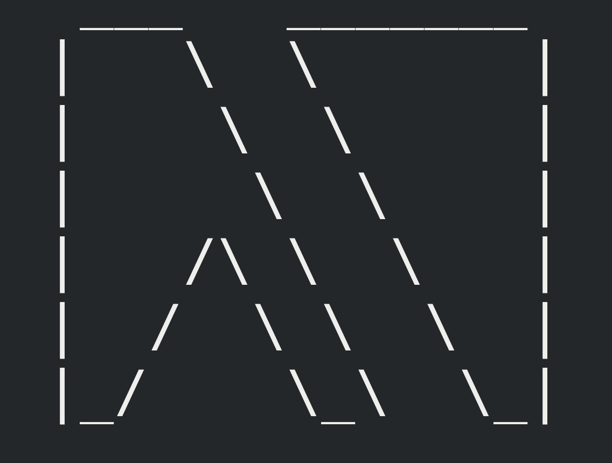

# LamBox

## A Text User Interface Library for Haskell

***This project is a work-in-progress and is not fully operational yet***

LamBox uses the ncurses package to create a high level tool for creating tui's. 
Its main purpose is to streamline the process of creating a user interface and 
eliminate a lot of the boilerplate required to get ncurses up and running.

#### Example

    module Main where

    import UI.NCurses (Event(..))
    import UI.Lambox

    main :: IO ()
    main = lambox $ do
      (box1,box2) <- do
        (b1,b2) <- splitBox config Vertical 0.5
        nb1 <- setTitle b1 (Just title)
        pure (nb1, b2)
      writeStr box1 2 2 "Hello World!"
      writeStr box2 2 2 "Press 'q' to quit!"
      update
      go
      deleteBox box1
      deleteBox box2
      where
        go = onEventGlobal (/= EventCharacter 'q') (\_ -> update *> go)
        title = Title "LamBox" AlignRight AlignTop
        config = Config 2 2 22 10 (BoxAttributes Line Nothing)
