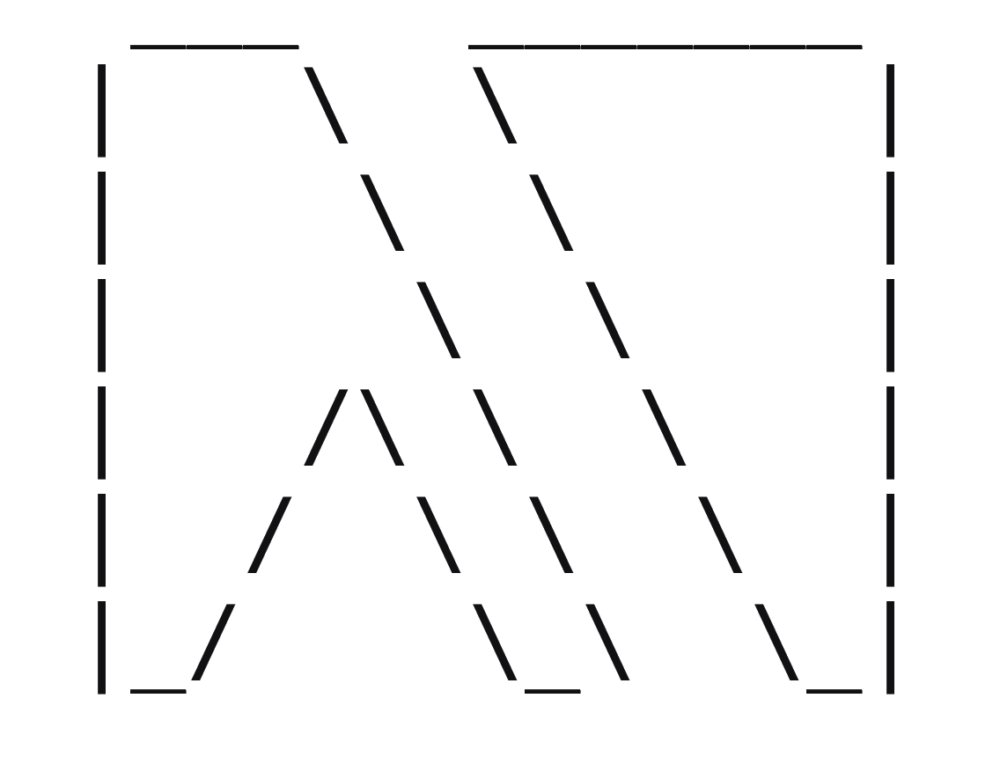

# LamBox

## A Terminal User Interface Library for Haskell

***This project is a work-in-progress and is not fully operational yet***

LamBox uses the ncurses package to provide a high level tool for creating tui's. 
Its main purpose is to streamline the process of creating a user interface and 
eliminate a lot of the boilerplate required to get ncurses up and running.

#### Example

    {-# LANGUAGE OverloadedStrings #-}
    module Main where

    import UI.NCurses (Event(..))
    import UI.Lambox

    main :: IO ()
    main = lambox $ do
      (box1,box2) <- do
        (b1,b2) <- splitBox config Vertical 0.5
        nb1 <- withBox b1
          [ setTitle (Just title)
          , writeStr 2 2 "Hello World!"
          ]
        nb2 <- writeStr' b2 2 2 "Press 'q' to quit!"
        pure (nb1, nb2)
      update
      waitForGlobal (== EventCharacter 'q')
      deleteBoxes [box1, box2]
      where
        title = Title "LamBox" AlignTop AlignRight
        config = Config 2 2 22 10 (BoxAttributes Line Nothing) ""

